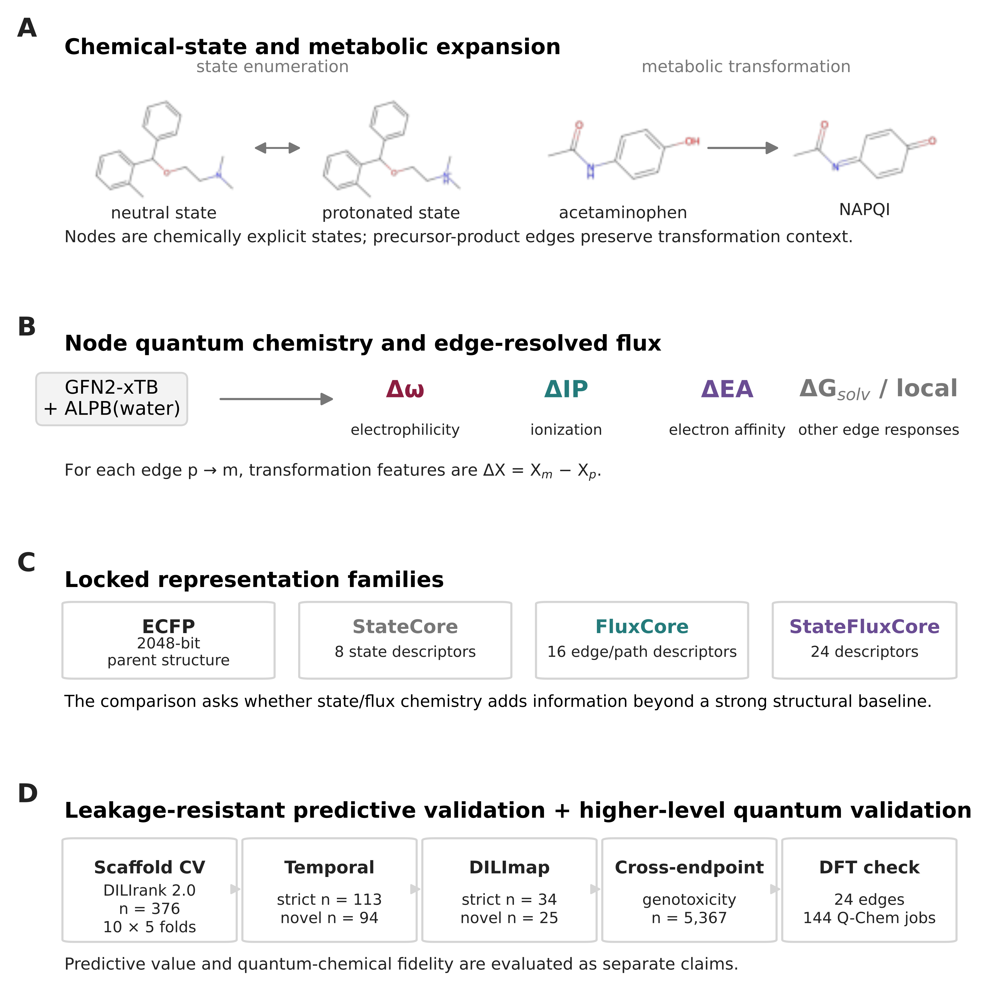

# StateFlux

Reproducibility archive for:

**StateFlux: DFT-Validated Quantum Reactivity across Predicted Metabolic State Networks Shows Limited Incremental Value for Broad Toxicity Prediction**

**Author:** Aris Tsai — Stanford Online High School, Stanford University  
**ORCID:** 0009-0004-8641-7647  
**GitHub:** https://github.com/aristsai09/stateflux  
**Zenodo DOI:** pending deposition

StateFlux tests whether quantum reactivity changes across predicted metabolic-state networks provide toxicity information beyond a strong parent-structure baseline. The repository contains the frozen post-repair prediction tables, split/overlap manifests, coproduct-repair audit, independent genotoxicity transfer outputs, the 24-edge higher-level DFT validation set, all 144 final Q-Chem inputs, retained Q-Chem provenance, and publication-figure code.



## Main result

On the locked DILIrank 2.0 development set, ECFP achieved AUROC/AUPRC 0.824883/0.772693, while ECFP + FluxCore achieved 0.804924/0.743027 and ECFP + StateFluxCore achieved approximately 0.800962/0.7261. Strict temporal/scaffold-novel testing and an independent 5,367-compound genotoxicity benchmark did not reveal a consistent broad predictive gain. In contrast, the selected transformation-induced quantum signal showed strong higher-level agreement: GFN2-xTB versus DFT Δω Pearson r = 0.962993 with MAE = 0.408031 eV across 24 transformations.

The intended interpretation is therefore narrow: **quantum-chemical fidelity and incremental predictive utility are separate claims.**

## Repository map

- `data/dili/` — final post-coproduct-repair DILI metrics, predictions, fold metrics, and paired bootstrap results.
- `data/external/` — strict and scaffold-novel temporal/DILImap reconstructions and final metrics.
- `data/genotoxicity/` — independent Hagan-Shah 5,367-compound transfer benchmark.
- `data/coproduct/` — drug-centric coproduct audit, replacements, repaired features, and xTB accounting.
- `data/dft/` — 24-edge/48-structure DFT validation tables and the final 144-job Q-Chem manifest.
- `qchem/inputs/` — all 144 final ωB97X-D/6-31+G*/SMD(water) Q-Chem input files.
- `qchem/geometries_xyz/` — 48 machine-readable neutral parent/product geometries.
- `qchem/raw_returns/` — retained returned Q-Chem archives used for final provenance.
- `scripts/original/` — archived StateFlux analysis/figure scripts.
- `scripts/figures/build_figures.py` — portable generator for the publication figures using repository-relative paths.
- `figures/` — final publication-quality PNG/SVG/PDF assets.
- `environment/` — frozen environment records plus exact xTB provenance.
- `CODE_TO_RESULT_MAP.md` — direct mapping from manuscript results to machine-readable files.
- `MANIFEST.csv` — SHA-256 manifest for the deposited files.

## Reproducing the publication figures

Create the supplied Conda environment and run the figure builder from the repository root:

```bash
conda env create -f environment/environment.yml
conda activate stateflux-reproducibility
python scripts/figures/build_figures.py
```

The figure builder resolves all data paths relative to this repository. The committed figures are the exact submission-facing assets.

## xTB provenance

The original StateFlux semiempirical calculations used **xTB 6.7.1** with the **GFN2-xTB** method and ALPB(water). Provenance was recovered from the original `p05_stateflux` Conda environment:

- xTB version: `6.7.1`
- xTB commit identifier: `edcfbbe`
- conda-forge build: `gfortran_hca11032_5` (`win-64`)
- executable SHA-256: `e11f074b519c3b226f3fab4902f36555c4bfb204cc0365bdb196313124e3dc1b`

See `environment/StateFlux_xtb_provenance.txt`, `environment/StateFlux_xtb-6.7.1_conda_metadata.json`, and `environment/StateFlux_p05_stateflux_conda_history.txt`.

## Higher-level DFT validation

The selected 24 direct parent-to-metabolite transformations comprise 10 dealkylations, 6 oxidations, and 8 Phase-II conjugations. The 144 Q-Chem calculations used ωB97X-D/6-31+G*/SMD(water). Final SCF targets were 137 calculations at 10^-8, four at 10^-7, and three at 10^-5. The electronic-response comparison validates the consistency of the calculated response for these selected predicted transformations; it does **not** establish the biological occurrence or abundance of every predicted metabolic pathway.

## Software provenance

Key retained versions include Python 3.11.16, RDKit 2025.09.6, pandas 3.0.5, NumPy 2.4.6, scikit-learn 1.9.0, BioTransformer 3.0.0, xTB 6.7.1, and Q-Chem 6.2.0. WebMO was used as the Q-Chem submission interface.

## Citation

A `CITATION.cff` file is provided. A Zenodo DOI will be added after the GitHub release is archived on Zenodo.
